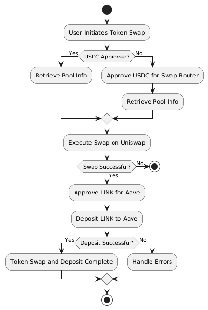

# DeFi Script for Uniswap and Aave Integration

## Overview of Script

This script is a sophisticated DeFi application that integrates the functionalities of Uniswap and Aave protocols. The workflow involves swapping USDC for LINK tokens on Uniswap and then utilizing the swapped LINK tokens to supply liquidity on Aave, thus earning interest.

### Key Steps in the Workflow:

1. **User Initiates Token Swap**: The script starts by allowing the user to specify the amount of USDC they wish to swap for LINK on the Uniswap decentralized exchange.

2. **Approve USDC**: Before the swap can occur, the user must approve the Uniswap Swap Router to spend their USDC.

3. **Retrieve Pool Information**: The script fetches the necessary pool information from Uniswap's Factory contract to ensure that the correct swap parameters are set.

4. **Execute Swap**: The script then performs the token swap on Uniswap, converting the specified amount of USDC to LINK.

5. **Approve LINK for Aave**: After the successful swap, the script approves the swapped LINK tokens for Aave's lending pool.

6. **Deposit LINK to Aave**: The LINK tokens are deposited into Aave, where they start earning interest.

7. **Error Handling**: The script includes error handling to manage any issues that may arise during the token swap or deposit processes.

This script demonstrates the power of DeFi composability by integrating multiple protocols to optimize asset utility and generate yield.

## Diagram Illustration

The diagram below illustrates the sequence of steps and interactions between the Uniswap and Aave protocols.

## Code Explanation

This section provides a comprehensive explanation of the DeFi script, highlighting the key functions, the logic behind them, and how the script interacts with the Uniswap and Aave protocols.

### Key Functions and Their Roles

1. **`approveToken()`**
   - **Purpose**: This function allows the user to approve a specific amount of a token (USDC) to be used by the Uniswap Swap Router contract.
   - **Logic**: 
     - The function creates a contract instance of the token using its address, ABI, and the user's wallet.
     - It calculates the amount to be approved in the correct units.
     - It prepares and sends an approval transaction to the blockchain.
     - Upon transaction confirmation, it logs the approval details.

2. **`getPoolInfo()`**
   - **Purpose**: This function retrieves information about a liquidity pool from Uniswap's Factory contract.
   - **Logic**:
     - It calls the `getPool` method on the factory contract with the token addresses and a fee tier.
     - If the pool address is found, it creates a pool contract instance.
     - It then fetches and returns the pool's token addresses and fee information.

3. **`prepareSwapParams()`**
   - **Purpose**: To set up the necessary parameters for executing a token swap on Uniswap.
   - **Logic**:
     - This function constructs a parameters object containing details like input and output token addresses, fee, recipient address, and the amount to be swapped.

4. **`executeSwap()`**
   - **Purpose**: This function performs the actual token swap on Uniswap using the provided swap parameters.
   - **Logic**:
     - It calls the `exactInputSingle` method on the Swap Router contract with the swap parameters to create a transaction.
     - The transaction is sent to the blockchain using the user's wallet, and the receipt is logged for verification.

5. **`depositToAave()`**
   - **Purpose**: To deposit the swapped LINK tokens into the Aave protocol to start earning interest.
   - **Logic**:
     - The function first approves the Aave lending pool contract to spend the LINK tokens.
     - It then calls the `deposit` function on the Aave contract with the LINK token details and the amount to be deposited.
     - It logs the transaction details once the deposit is successful.

### Script Flow and Protocol Interactions

- **Initialization**: The script initializes by setting up the required contract instances and configurations.
- **Token Approval**: Before any token swap or deposit can occur, the script ensures that the necessary approvals are in place.
- **Uniswap Interaction**: The script retrieves the appropriate pool information, prepares swap parameters, and executes the swap on Uniswap.
- **Aave Interaction**: After the swap, the script approves and deposits the LINK tokens into Aave, allowing the user to earn interest.
- **Error Handling**: Throughout the process, the script includes error handling mechanisms to manage exceptions and provide informative feedback to the user.

